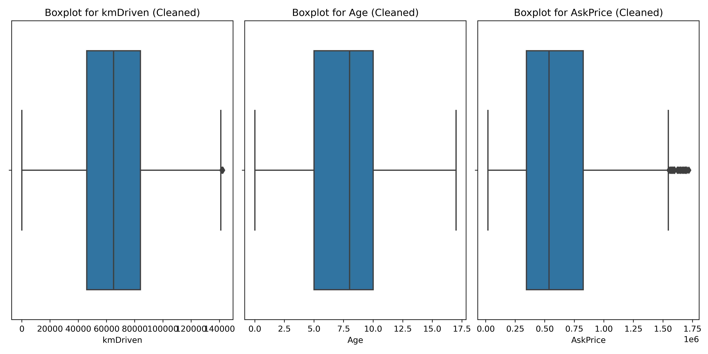
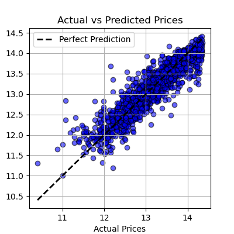

# README

## Overview
This Python script is designed to preprocess and analyze a used car dataset. It includes data cleaning, visualization, regression, and classification models to predict car prices and categorize them into price categories.

## Features
1. **Data Cleaning and Preprocessing**:
    - Handles missing values.
    - Cleans and formats columns (`kmDriven`, `AskPrice`).
    - Groups rare brands and models into an `Other` category.
    - Removes outliers using the Interquartile Range (IQR).

2. **Data Visualization**:
    - Boxplots for numerical features.
    - Distribution plots for the target variable (`AskPrice`).
    - Class distribution visualization using bar and pie charts.

3. **Predictive Modeling**:
    - Regression using Gaussian Process Regressor to predict car prices.
    - Classification using Gaussian Process Classifier to categorize car prices into `Affordable` and `Expensive`.

4. **Model Evaluation**:
    - Evaluates regression models using MAE, MSE, RMSE, and R² scores.
    - Evaluates classification models using accuracy, confusion matrix, and classification report.

5. **New Data Predictions**:
    - Allows predictions on new car data for both price prediction and price category classification.

## Requirements

### Libraries
The script requires the following Python libraries:
- pandas
- numpy
- matplotlib
- seaborn
- scikit-learn

### Input Dataset
- A CSV file named `used_car_dataset.csv` with the following columns:
    - `Brand`, `model`, `Age`, `kmDriven`, `Transmission`, `Owner`, `FuelType`, `AskPrice`, etc.

### Output Files
- `boxplots_numerical_features.png`: Boxplots for raw numerical features.
- `boxplots_cleaned.png`: Boxplots for cleaned numerical features.
- `actual_vs_predicted_prices.png`: Scatter plot for actual vs. predicted prices.

## Usage

1. **Load and Preprocess the Dataset**:
   - Place the `used_car_dataset.csv` file in the same directory as the script.
   - Run the script to clean and preprocess the data.

2. **Visualization**:
   - Visualizations will be displayed and saved as PNG files in the working directory.

3. **Regression and Classification**:
   - The script trains and evaluates models using the Gaussian Process framework.
   - Results, including metrics and visualizations, will be printed to the console.

4. **Predict on New Data**:
   - Modify the `new_data_car` or `new_data` DataFrame with new car details.
   - Run the respective sections for price prediction or price category classification.

## Example
```python
# Predicting price for new data
new_data_car = pd.DataFrame({
    'Brand': ['Mercedes-Benz','Maruti Suzuki'],
    'model': ['C-Class','Wagon-R'],
    'Age': [8,1],
    'kmDriven': [5400,28],
    'Transmission': ['Automatic','Manual'],
    'Owner': ['second','first'],
    'FuelType': ['Diesel','Hybrid/CNG']
})

predicted_ask_price = np.exp(pipeline.predict(new_data_car))
print(f"Predicted Ask Price: {predicted_ask_price}")

# Predicting price category for new data
new_data = pd.DataFrame({
    'Brand': ['Mercedes-Benz'],
    'model': ['C-Class'],
    'Age': [6],
    'kmDriven': [54000],
    'Transmission': ['Manual'],
    'Owner': ['first'],
    'FuelType': ['Petrol']
})

new_data_pred = gp_pipeline.predict(new_data)
print(f"Predicted Price Category: {new_data_pred[0]}")
```

## Evaluation Metrics
- Regression:
    - Mean Absolute Error (MAE)
    - Mean Squared Error (MSE)
    - Root Mean Squared Error (RMSE)
    - R² Score

- Classification:
    - Accuracy
    - Confusion Matrix
    - Classification Report

## Visualization Examples
- **Boxplots for numerical features**:
  
- **Actual vs. Predicted Prices**:
  
- **Class Distribution**:
  

